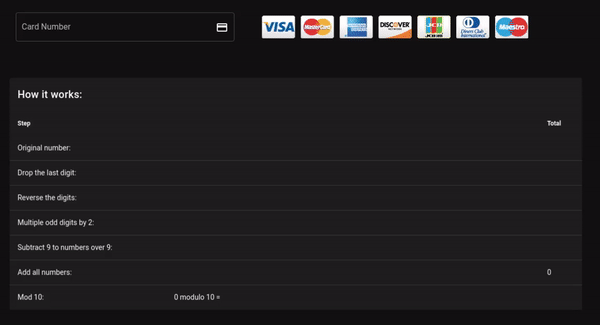

## Getting started
```bash
# Clone this repository
git clone git@github.com:reiallenramos/card-validator.git my_app

# Install dependencies
cd my_app
npm install
```

### Compiles and hot-reloads for development
```
npm run serve
```

### Linter
```
npm run lint
```

### Deploying to Github Pages
For every successful push to the `master` branch, Github Actions automagically builds a `dist/` folder with static files and pushes to the `gh-pages` branch.


<a href="https://www.buymeacoffee.com/reiallenramos" target="_blank"></a>
